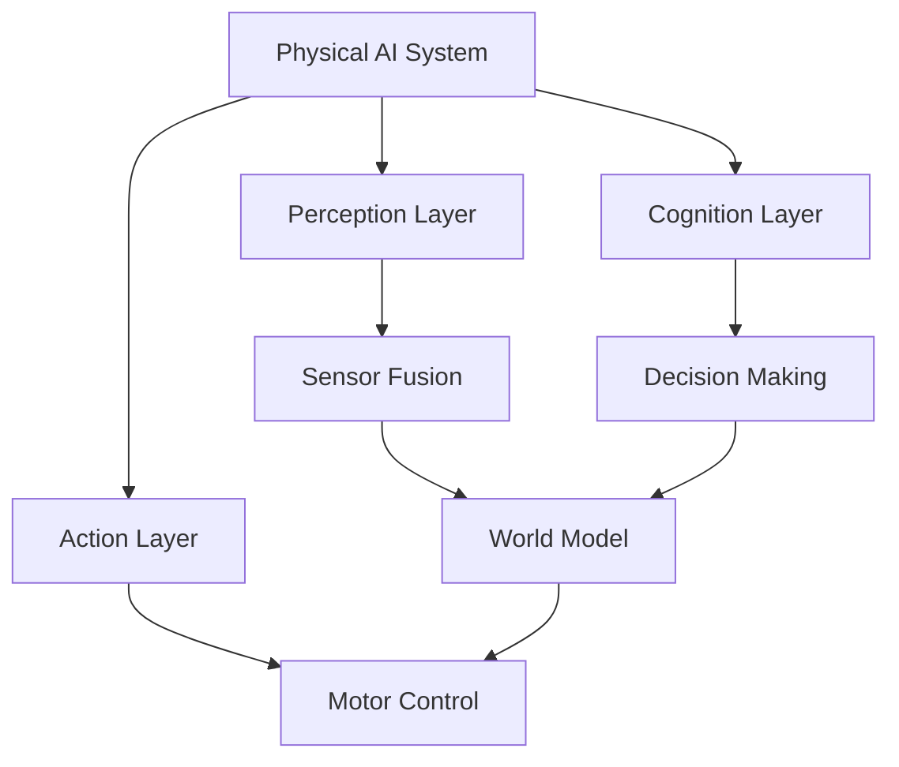
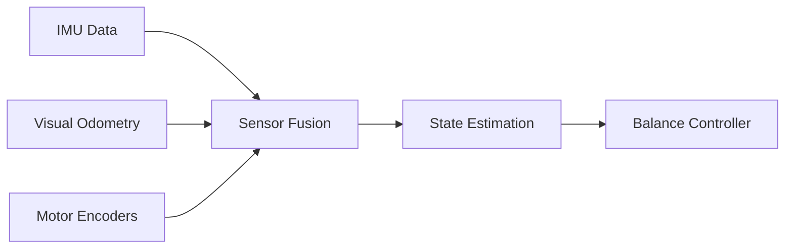

# Chapter 1: Foundations of Physical AI & Embodied Intelligence

:::tip 🎯 Learning Objectives
By the end of this chapter, you will:
- Understand the fundamental shift from digital AI to Physical AI
- Grasp the concept of embodied intelligence
- Learn about sensor ecosystems in robotics
- Explore the current humanoid robotics landscape
:::

---

## 📑 Table of Contents

- [Introduction](#introduction)
- [From Digital AI to Physical Reality](#from-digital-ai-to-physical-reality)
- [The Embodied Intelligence Paradigm](#the-embodied-intelligence-paradigm)
- [The Sensor Ecosystem](#the-sensor-ecosystem)
- [The Humanoid Robotics Landscape](#the-humanoid-robotics-landscape)
- [Key Takeaways](#key-takeaways)
- [What's Next](#whats-next)

---

## Introduction

Physical AI represents one of the most exciting frontiers in modern technology—where artificial intelligence leaves the digital realm and enters our physical world. This chapter explores how AI systems are evolving from screen-based applications to embodied robots that can see, touch, and interact with their environment.

> **"The future of AI is not just about thinking—it's about doing."** - Leading Robotics Researcher

---

## From Digital AI to Physical Reality

### Understanding the Paradigm Shift

Physical AI represents a **fundamental transformation** in artificial intelligence—moving beyond screen-based interactions to robots that comprehend and navigate the physical world.

#### Key Differences: Digital AI vs Physical AI

| Aspect | Digital AI | Physical AI |
|--------|-----------|-------------|
| **Environment** | Virtual/digital spaces | Real-world physical spaces |
| **Constraints** | Computational limits | Physical laws (gravity, friction, momentum) |
| **Interaction** | Screen, text, images | Sensors, actuators, physical contact |
| **Decision Making** | Can retry instantly | Must account for real-time consequences |
| **Challenges** | Data processing | Uncertainty, real-time processing, safety |

### The Physical World Challenge

Unlike traditional AI confined to digital spaces, Physical AI systems must:

1. **Process Real-Time Sensor Data**
   - Millisecond-level response times
   - Continuous data streams from multiple sources
   - Handle noisy and incomplete information

2. **Make Decisions Under Uncertainty**
   - Unpredictable environments
   - Incomplete world knowledge
   - Safety-critical situations

3. **Execute Actions with Physical Consequences**
   - Irreversible movements
   - Energy and wear considerations
   - Impact on surroundings and people

:::info 💡 Real-World Example
Consider a chess-playing AI versus a robot that plays physical chess. The digital AI can instantly undo moves and try millions of possibilities. The physical robot must:
- Accurately perceive board positions
- Plan precise arm movements
- Grip pieces without crushing them
- Execute moves it cannot undo
:::

### Humanoid Robots: The Ultimate Test

**Humanoid robots** exemplify this transition for several compelling reasons:

- **Human-Centered Design**: Navigate environments built for humans (stairs, doorways, chairs)
- **Shared Morphology**: Learn from abundant human demonstration data
- **Universal Tool Use**: Operate tools designed for human hands
- **Natural Interaction**: Communicate through familiar gestures and movements


---

## The Embodied Intelligence Paradigm

### What is Embodied Intelligence?

**Embodied intelligence** is the principle that an AI's "brain" is fundamentally inseparable from its physical "body." The intelligence emerges from the interaction between:

- **Hardware** (sensors, actuators, physical form)
- **Software** (algorithms, neural networks)
- **Environment** (the world it interacts with)

### The Mind-Body Connection in Robotics

In embodied AI systems:

| Component | Biological Analog | Robotic Implementation |
|-----------|-------------------|------------------------|
| **Sensors** | Eyes, ears, skin | Cameras, microphones, tactile sensors |
| **Processors** | Brain | Onboard computers, GPUs |
| **Actuators** | Muscles | Motors, servos, hydraulics |
| **Structure** | Skeleton | Frame, chassis, joints |

:::warning 🔍 Critical Insight
A humanoid robot's form factor isn't just aesthetic—it's functional. The physical body determines:
- What tasks can be accomplished
- How efficiently learning occurs
- Which environments can be navigated
- What training data is applicable
:::

### Why Human Form Matters

Humanoid robots trained with **abundant human interaction data** excel in our world because:

1. **Shared Constraints**: Experience the same physical limitations
2. **Transfer Learning**: Human demonstrations directly apply
3. **Ergonomic Compatibility**: Use our tools and spaces without modification
4. **Intuitive Learning**: Observe and mimic human behavior

### The Rich Learning Environment

Physical embodiment creates immediate feedback loops:
```
Action → Physical Consequence → Sensor Feedback → Learning
```

**Example Scenario**: Teaching a robot to pour water
- **Digital Simulation**: Can reset instantly, perfect physics
- **Physical Robot**: Learns about:
  - Water flow dynamics (varies with speed)
  - Container weight distribution
  - Splash prevention
  - Recovery from mistakes

Students see **immediate consequences** of their algorithms in physical space, making abstract concepts tangible and memorable.

---

## The Sensor Ecosystem

Modern humanoid robots perceive their environment through **multiple sensor modalities** working in concert—a process called **sensor fusion**.

### Primary Sensor Types

#### 1. 🎥 **Vision Sensors**

##### RGB Cameras
- **Purpose**: Color image capture
- **Use Cases**: Object recognition, visual navigation
- **Specifications**: 1080p-4K resolution, 30-60 fps
- **Advantages**: Rich visual information, color detection
- **Limitations**: No depth information, lighting dependent

##### Depth Cameras (Intel RealSense, Azure Kinect)
- **Purpose**: Capture both color AND 3D structure
- **Technology**: Structured light or time-of-flight
- **Applications**: 
  - Object grasping
  - Obstacle detection
  - 3D reconstruction
- **Range**: Typically 0.3m to 10m
- **Output**: RGB + Depth map (distance to each pixel)

:::tip 🔧 Practical Application
Depth cameras enable robots to distinguish between a photo of a chair and an actual chair—critical for safe navigation!
:::

#### 2. 📡 **LiDAR (Light Detection and Ranging)**

**How it Works**: Emits laser pulses and measures return time

**Key Characteristics**:
- **Range**: 0.1m to 100m+ (depending on model)
- **Accuracy**: ±1-3cm
- **Scan Rate**: Thousands to millions of points per second
- **Weather**: Works in various lighting conditions

**Applications**:
- Precise distance measurements
- 3D environment mapping
- Real-time obstacle avoidance
- SLAM (Simultaneous Localization and Mapping)

**Common Models**:
| Model | Range | Points/sec | Use Case |
|-------|-------|------------|----------|
| Velodyne VLP-16 | 100m | 300,000 | Outdoor navigation |
| Livox Mid-360 | 40m | 200,000 | Mobile robots |
| RPLIDAR A1 | 12m | 8,000 | Indoor mapping |

#### 3. ⚖️ **IMU (Inertial Measurement Unit)**

**Components**:
- **Accelerometer**: Measures linear acceleration
- **Gyroscope**: Measures angular velocity
- **Magnetometer**: Measures magnetic field (compass)

**Critical for**:
- Balance and stability (especially in bipedal walking)
- Orientation tracking
- Fall detection
- Motion prediction

**Update Rate**: 100-1000 Hz (much faster than cameras!)


#### 4. 💪 **Force & Torque Sensors**

**Purpose**: Measure mechanical forces and moments

**Applications**:
- **Compliant Grasping**: Adjust grip strength automatically
- **Collision Detection**: Detect unexpected contact
- **Human-Robot Interaction**: Safe physical collaboration
- **Assembly Tasks**: Apply precise forces

**Example**: A humanoid robot using force sensors can:
- Shake hands with appropriate pressure
- Detect when a held object is slipping
- Stop immediately upon accidental human contact

#### 5. 🎧 **Additional Sensors**

| Sensor Type | Function | Example Use |
|-------------|----------|-------------|
| **Microphone Arrays** | Sound localization | Turn toward speaking person |
| **Tactile Sensors** | Touch detection | Fingertip pressure sensing |
| **Temperature Sensors** | Heat detection | Safe object handling |
| **GPS/GNSS** | Global positioning | Outdoor navigation |

### Sensor Fusion: Creating a Coherent World Model

**Sensor fusion** combines data from multiple sources to create a more accurate and robust understanding than any single sensor could provide.

#### Why Fusion Matters

**Single Sensor Limitations**:
- Cameras fail in darkness
- LiDAR can't detect glass
- IMUs drift over time
- Encoders accumulate errors

**Fused System Benefits**:
- ✅ **Increased Accuracy**: Cross-validation between sensors
- ✅ **Reduced Uncertainty**: Statistical confidence improvement
- ✅ **Better Decision-Making**: Comprehensive environmental understanding
- ✅ **Enhanced Reliability**: Redundancy when sensors fail

#### Fusion Example: Robot Localization
```
GPS (outdoor, ±5m) 
    + 
LiDAR (precise, local) 
    + 
IMU (high-frequency orientation)
    + 
Wheel Encoders (distance traveled)
    = 
Accurate position estimate (±5cm)
```

:::info 📚 Learning Path
Teaching students to fuse diverse data streams into coherent world models forms the **foundation of Physical AI education**. Start with simple 2-sensor fusion before progressing to complex multi-modal systems.
:::

---

## The Humanoid Robotics Landscape

The field has evolved rapidly from expensive research prototypes to commercially available platforms accessible to students and educators.

### Current Ecosystem Overview

#### **Research-Grade Platforms**

##### Boston Dynamics Atlas
- **Capabilities**: Dynamic parkour, backflips, complex manipulation
- **Cost**: Not commercially available
- **Use**: Research, demonstration of state-of-the-art

##### Tesla Optimus
- **Development**: Rapid iteration, leveraging automotive AI
- **Goal**: General-purpose humanoid for real-world tasks
- **Status**: Active development, limited availability

#### **Commercial Platforms**

##### Unitree G1 Humanoid
- **Height**: ~130cm
- **Weight**: ~35kg
- **Capabilities**: 
  - Dynamic walking and running
  - Object manipulation
  - Open SDK access
- **Cost**: ~$16,000 USD
- **Ideal For**: University labs, research teams

**Key Features**:
- Open-source software support
- ROS 2 compatible
- Active developer community
- Regular firmware updates

##### Agility Robotics Digit
- **Design**: Bipedal, specialized for logistics
- **Capabilities**: Package handling, warehouse navigation
- **Commercialization**: Deployed in pilot programs

#### **Educational Platforms**

##### Table-Top Humanoids
**Examples**: ROBOTIS OP3, XYZrobot Bolide
- **Cost**: $3,000-$8,000
- **Size**: 30-50cm height
- **Purpose**: 
  - Kinematics learning
  - Inverse kinematics practice
  - Gait algorithm development
  - Safe experimentation

**Advantages for Students**:
- ✅ Affordable for educational budgets
- ✅ Safe (low power, small size)
- ✅ Full programming access
- ✅ Repair and modification friendly

#### **Quadruped Proxies**

##### Unitree Go2
- **Form Factor**: Four-legged
- **Cost**: $1,600-$3,000
- **Why Useful**: 

Even though quadrupeds aren't humanoid, they serve as **effective teaching platforms** for transferable skills:

| Skill | Quadruped Platform | Transfers to Humanoid |
|-------|-------------------|----------------------|
| **ROS 2** | Navigate, map environments | Same framework |
| **SLAM** | Build 3D maps | Identical algorithms |
| **Path Planning** | A*, RRT algorithms | Direct transfer |
| **Sensor Fusion** | LiDAR + Camera + IMU | Same principles |
| **Autonomy** | Decision-making systems | Core concepts apply |

:::tip 💰 Budget-Conscious Learning
Start with quadruped platforms or simulation to teach fundamentals, then transition to humanoid hardware for advanced topics.
:::

### Platform Comparison Matrix

| Platform | Price Range | Best For | Difficulty | Hardware Access |
|----------|-------------|----------|------------|-----------------|
| **Simulation (Gazebo/Isaac)** | Free | Beginners, algorithm testing | Easy | Full |
| **Quadrupeds (Go2)** | $1,600-$3,000 | ROS, SLAM, navigation | Medium | Full |
| **Table-Top Humanoids** | $3,000-$8,000 | Kinematics, small tasks | Medium | Full |
| **Unitree G1** | ~$16,000 | Advanced research | Hard | Partial |
| **Research Platforms** | $50,000+ | Cutting-edge research | Very Hard | Limited |

### Industry Trends

**Current Developments** (2024-2026):
1. **Democratization**: Prices dropping, availability increasing
2. **AI Integration**: Foundation models for robot control
3. **Sim-to-Real**: Training in simulation, deploying to hardware
4. **Standardization**: Common frameworks (ROS 2, Isaac Sim)
5. **Safety Focus**: Better collision avoidance, compliant control

---

## Key Takeaways

### 🎯 Essential Concepts

1. **Physical AI is Different**
   - Must obey physical laws
   - Real-time constraints
   - Irreversible actions

2. **Embodiment Matters**
   - Hardware shapes intelligence
   - Form factor determines capability
   - Human form enables human-data learning

3. **Sensors are Everything**
   - Multiple modalities required
   - Fusion creates robust perception
   - Foundation of autonomous behavior

4. **Accessible Platforms Exist**
   - Educational options available
   - Quadrupeds teach transferable skills
   - Simulation enables risk-free learning

### 📊 Quick Reference Chart
```
Physical AI Learning Path:
    
Simulation → Quadruped → Table-Top → Full Humanoid
    ↓            ↓           ↓            ↓
Algorithms   Navigation  Kinematics   Integration
Safety       SLAM        Manipulation  Deployment
```

