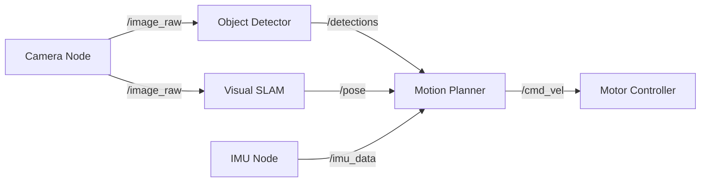
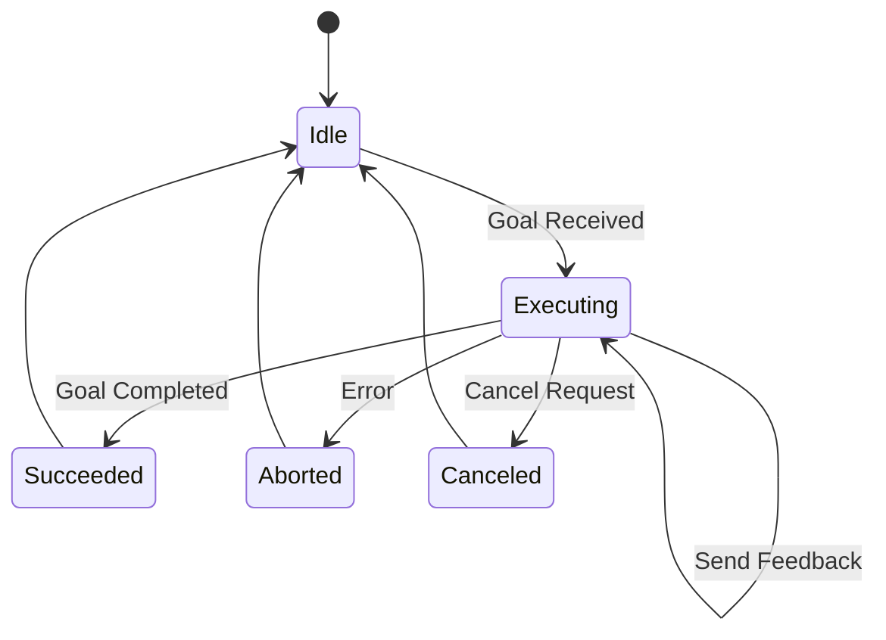
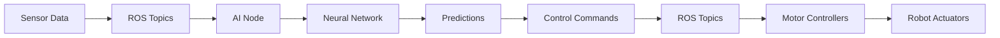

# Chapter 2: ROS 2 - The Nervous System of Robotics

:::tip 🎯 Learning Objectives
By the end of this chapter, you will:
- Understand ROS 2 architecture and distributed systems
- Master communication patterns: topics, services, and actions
- Create and describe robots using URDF
- Bridge Python AI models to ROS 2 controllers
- Build practical robotic applications with rclpy
:::

---

## 📑 Table of Contents

- [Introduction to ROS 2](#introduction-to-ros-2)
- [ROS 2 Architecture and Core Concepts](#ros-2-architecture-and-core-concepts)
- [Communication Patterns](#communication-patterns)
- [URDF: Describing Your Robot](#urdf-describing-your-robot)
- [Bridging Python AI to ROS Controllers](#bridging-python-ai-to-ros-controllers)
- [Hands-On Examples](#hands-on-examples)
- [Key Takeaways](#key-takeaways)
- [What's Next](#whats-next)

---

## Introduction to ROS 2

### What is ROS 2?

**ROS 2 (Robot Operating System 2)** is not an operating system in the traditional sense—it's a **flexible middleware framework** that serves as the nervous system connecting a robot's sensors, processors, and actuators.

> **"ROS 2 is to robotics what the internet protocol is to networking—a common language that enables diverse components to work together."**

### Why ROS 2 Matters

| Aspect | Benefit |
|--------|---------|
| **Industry Standard** | Used by 90% of commercial robotics companies |
| **Open Source** | Free, community-driven, extensive libraries |
| **Modular** | Build complex systems from simple components |
| **Cross-Platform** | Linux, Windows, macOS support |
| **Real-Time Capable** | DDS (Data Distribution Service) for deterministic communication |

### ROS 1 vs ROS 2

| Feature | ROS 1 | ROS 2 |
|---------|-------|-------|
| **Communication** | Custom TCPROS | DDS (industry standard) |
| **Real-Time** | Limited | Native support |
| **Security** | Basic | Encryption, authentication |
| **Multi-Robot** | Challenging | Built-in |
| **Embedded Systems** | Difficult | Optimized (micro-ROS) |
| **Python Support** | Python 2/3 | Python 3+ |

:::info 📌 Why We Focus on ROS 2
ROS 1 reached end-of-life in 2025. All new robotics projects should use ROS 2, which is actively developed and supported through 2030+.
:::

---

## ROS 2 Architecture and Core Concepts

### The Distributed System Paradigm

Unlike **monolithic programs** (everything in one large application), ROS 2 applications consist of **independent nodes** communicating through well-defined interfaces.

#### Traditional Approach (Monolithic)
```
┌─────────────────────────────────────┐
│    Single Large Program             │
│  ┌──────┐  ┌──────┐  ┌──────┐      │
│  │Camera│→ │Process│→│Motors│      │
│  └──────┘  └──────┘  └──────┘      │
│                                     │
│  (Everything crashes if one fails)  │
└─────────────────────────────────────┘
```

#### ROS 2 Approach (Distributed)
```
┌──────────┐    ┌──────────┐    ┌──────────┐
│ Camera   │───→│ Image    │───→│ Motion   │
│ Node     │    │ Process  │    │ Planner  │
└──────────┘    │ Node     │    │ Node     │
                └──────────┘    └──────────┘
                      ↓
                ┌──────────┐
                │ Motor    │
                │ Control  │
                │ Node     │
                └──────────┘
```

### Benefits of Distributed Architecture

#### 1. **Modularity**
Each node handles a specific responsibility:
- **Camera Node**: Captures and publishes images
- **Image Processing Node**: Detects objects
- **Motion Planner Node**: Plans paths
- **Motor Controller Node**: Executes movements

#### 2. **Independent Development**
- ✅ Teams work on different nodes simultaneously
- ✅ Test components in isolation
- ✅ Replace implementations without affecting others
- ✅ Debug specific failures without entire system

#### 3. **Reusability**
- ✅ Share nodes across projects
- ✅ Use community packages
- ✅ Build libraries of common functionality

#### 4. **Fault Tolerance**
- ✅ One node crash doesn't kill entire system
- ✅ Restart failed components independently
- ✅ Graceful degradation possible

:::warning ⚠️ Real-World Example
In a humanoid robot:
- If the vision node crashes, the robot might switch to LiDAR-only navigation
- If one arm's controller fails, the other arm continues operating
- Monitoring nodes can automatically restart failed components
:::

### The ROS 2 Graph

The **ROS 2 computational graph** represents all running nodes and their connections:


**Key Components**:
- **Nodes**: Processes that perform computation
- **Topics**: Named channels for data streams
- **Messages**: Data structures sent over topics
- **Services**: Request-response interactions
- **Actions**: Long-running tasks with feedback

---

## Communication Patterns

ROS 2 provides three primary communication patterns, each suited for different scenarios.

### 1. Topics (Publish-Subscribe)

#### Concept
**Topics** enable many-to-many, asynchronous communication for **continuous data streams**.
```
Publishers → [Topic] ← Subscribers
```

#### When to Use Topics
- ✅ Sensor data (cameras, LiDAR, IMU)
- ✅ Continuous robot state
- ✅ Command velocities
- ✅ Any data that flows continuously

#### Characteristics

| Feature | Description |
|---------|-------------|
| **Pattern** | Publish-Subscribe |
| **Coupling** | Loose (publishers/subscribers don't know about each other) |
| **Timing** | Asynchronous |
| **Frequency** | Continuous streams (1-1000+ Hz) |
| **Example** | Camera publishing 30 images/second |

#### Code Example: Publisher (Python)
```python
import rclpy
from rclpy.node import Node
from sensor_msgs.msg import Image
from cv_bridge import CvBridge
import cv2

class CameraPublisher(Node):
    def __init__(self):
        super().__init__('camera_publisher')
        
        # Create publisher
        self.publisher = self.create_publisher(
            Image,           # Message type
            '/camera/image', # Topic name
            10              # Queue size
        )
        
        # Timer for 30 Hz publishing
        self.timer = self.create_timer(1.0/30.0, self.timer_callback)
        self.bridge = CvBridge()
        self.cap = cv2.VideoCapture(0)
        
        self.get_logger().info('Camera publisher started')
    
    def timer_callback(self):
        ret, frame = self.cap.read()
        if ret:
            # Convert OpenCV image to ROS message
            msg = self.bridge.cv2_to_imgmsg(frame, 'bgr8')
            self.publisher.publish(msg)
            self.get_logger().info('Published image')

def main():
    rclpy.init()
    node = CameraPublisher()
    rclpy.spin(node)
    node.destroy_node()
    rclpy.shutdown()
```

#### Code Example: Subscriber (Python)
```python
import rclpy
from rclpy.node import Node
from sensor_msgs.msg import Image
from cv_bridge import CvBridge
import cv2

class ImageSubscriber(Node):
    def __init__(self):
        super().__init__('image_subscriber')
        
        # Create subscriber
        self.subscription = self.create_subscription(
            Image,
            '/camera/image',
            self.listener_callback,
            10
        )
        self.bridge = CvBridge()
        self.get_logger().info('Image subscriber started')
    
    def listener_callback(self, msg):
        # Convert ROS message to OpenCV image
        cv_image = self.bridge.imgmsg_to_cv2(msg, 'bgr8')
        
        # Process image (example: edge detection)
        edges = cv2.Canny(cv_image, 100, 200)
        
        # Display result
        cv2.imshow('Edges', edges)
        cv2.waitKey(1)
        
        self.get_logger().info('Received and processed image')

def main():
    rclpy.init()
    node = ImageSubscriber()
    rclpy.spin(node)
    node.destroy_node()
    rclpy.shutdown()
```

:::tip 💡 Best Practice
Use **Quality of Service (QoS)** profiles to tune reliability:
- `BEST_EFFORT`: Fast, lossy (sensor data)
- `RELIABLE`: Guaranteed delivery (critical commands)
:::

### 2. Services (Request-Response)

#### Concept
**Services** provide synchronous, request-response interactions for **discrete operations**.
```
Client → [Request] → Service Server
Client ← [Response] ← Service Server
```

#### When to Use Services
- ✅ One-time computations (inverse kinematics)
- ✅ State queries ("What's your current pose?")
- ✅ Configuration changes
- ✅ Any discrete, short-duration operation

#### Characteristics

| Feature | Description |
|---------|-------------|
| **Pattern** | Client-Server |
| **Coupling** | Direct (client knows server) |
| **Timing** | Synchronous (blocking) |
| **Duration** | Short (less than 1 second typical) |
| **Example** | "Calculate joint angles for target position" |

#### Code Example: Service Server
```python
import rclpy
from rclpy.node import Node
from example_interfaces.srv import AddTwoInts

class AdditionServer(Node):
    def __init__(self):
        super().__init__('addition_server')
        
        # Create service
        self.srv = self.create_service(
            AddTwoInts,
            'add_two_ints',
            self.add_callback
        )
        self.get_logger().info('Addition service ready')
    
    def add_callback(self, request, response):
        # Perform computation
        response.sum = request.a + request.b
        
        self.get_logger().info(
            f'Request: {request.a} + {request.b} = {response.sum}'
        )
        return response

def main():
    rclpy.init()
    node = AdditionServer()
    rclpy.spin(node)
    node.destroy_node()
    rclpy.shutdown()
```

#### Code Example: Service Client
```python
import rclpy
from rclpy.node import Node
from example_interfaces.srv import AddTwoInts

class AdditionClient(Node):
    def __init__(self):
        super().__init__('addition_client')
        
        # Create client
        self.client = self.create_client(AddTwoInts, 'add_two_ints')
        
        # Wait for service to be available
        while not self.client.wait_for_service(timeout_sec=1.0):
            self.get_logger().info('Waiting for service...')
        
        self.get_logger().info('Service connected')
    
    def send_request(self, a, b):
        # Create request
        request = AddTwoInts.Request()
        request.a = a
        request.b = b
        
        # Call service (blocking)
        future = self.client.call_async(request)
        rclpy.spin_until_future_complete(self, future)
        
        if future.result() is not None:
            result = future.result().sum
            self.get_logger().info(f'Result: {a} + {b} = {result}')
            return result
        else:
            self.get_logger().error('Service call failed')
            return None

def main():
    rclpy.init()
    node = AdditionClient()
    result = node.send_request(5, 7)
    node.destroy_node()
    rclpy.shutdown()
```

### 3. Actions (Long-Running Tasks)

#### Concept
**Actions** support long-running tasks with **feedback and cancellation**.
```
Client → [Goal] → Action Server
       ← [Feedback] ←
       ← [Result] ←
```

#### When to Use Actions
- ✅ Navigation to waypoint
- ✅ Grasping object
- ✅ Complex motion sequences
- ✅ Any task requiring progress updates

#### Characteristics

| Feature | Description |
|---------|-------------|
| **Pattern** | Client-Server with feedback |
| **Duration** | Long-running (seconds to minutes) |
| **Feedback** | Periodic progress updates |
| **Cancellation** | Can abort mid-execution |
| **Example** | "Navigate to kitchen" (updates: 25%, 50%, 75%, done) |

#### Action Lifecycle


#### Code Example: Action Server
```python
import rclpy
from rclpy.action import ActionServer
from rclpy.node import Node
from example_interfaces.action import Fibonacci
import time

class FibonacciActionServer(Node):
    def __init__(self):
        super().__init__('fibonacci_server')
        
        # Create action server
        self._action_server = ActionServer(
            self,
            Fibonacci,
            'fibonacci',
            self.execute_callback
        )
        self.get_logger().info('Fibonacci action server started')
    
    def execute_callback(self, goal_handle):
        self.get_logger().info('Executing goal...')
        
        # Initialize feedback
        feedback_msg = Fibonacci.Feedback()
        feedback_msg.partial_sequence = [0, 1]
        
        # Generate Fibonacci sequence
        for i in range(1, goal_handle.request.order):
            # Check if canceled
            if goal_handle.is_cancel_requested:
                goal_handle.canceled()
                self.get_logger().info('Goal canceled')
                return Fibonacci.Result()
            
            # Calculate next Fibonacci number
            feedback_msg.partial_sequence.append(
                feedback_msg.partial_sequence[i] + 
                feedback_msg.partial_sequence[i-1]
            )
            
            # Publish feedback
            goal_handle.publish_feedback(feedback_msg)
            self.get_logger().info(f'Feedback: {feedback_msg.partial_sequence}')
            time.sleep(0.5)
        
        # Mark as succeeded
        goal_handle.succeed()
        
        # Return result
        result = Fibonacci.Result()
        result.sequence = feedback_msg.partial_sequence
        return result

def main():
    rclpy.init()
    node = FibonacciActionServer()
    rclpy.spin(node)
    node.destroy_node()
    rclpy.shutdown()
```

:::info 📊 Communication Pattern Summary

| Pattern | Use Case | Duration | Blocking | Feedback |
|---------|----------|----------|----------|----------|
| **Topic** | Sensor streams | Continuous | No | N/A |
| **Service** | Quick queries | Less than 1 second | Yes | No |
| **Action** | Complex tasks | Seconds-minutes | No | Yes |

:::

---

## URDF: Describing Your Robot

### What is URDF?

**URDF (Unified Robot Description Format)** is an **XML-based language** for defining:
- Robot geometry and appearance
- Kinematic structure (joints and links)
- Dynamic properties (mass, inertia)
- Collision and visual meshes
- Sensors and actuators

> **"URDF is the blueprint that tells ROS 2 what your robot looks like and how it moves."**

### Why URDF Matters

URDF descriptions are used by:
- **Simulators** (Gazebo, Isaac Sim) - Physics simulation
- **Visualizers** (RViz) - 3D visualization
- **Planners** (MoveIt) - Motion planning
- **Controllers** - Joint control
- **Analysis Tools** - Dynamics computation

### URDF Structure

#### Core Elements

| Element | Purpose | Example |
|---------|---------|---------|
| **link** | Physical component | Arm segment, wheel, torso |
| **joint** | Connection between links | Hinge, slider, fixed |
| **robot** | Root container | Entire robot description |
| **visual** | Appearance | Mesh, color, texture |
| **collision** | Collision geometry | Simplified shapes |
| **inertial** | Mass properties | Mass, center of mass, inertia |

### Building a Simple Robot

#### Example: Two-Link Arm

Below is a complete URDF description for a simple two-joint robotic arm:
```text
<?xml version="1.0"?>
<robot name="simple_arm">
  
  <!-- Base Link -->
  <link name="base_link">
    <visual>
      <geometry>
        <cylinder length="0.1" radius="0.05"/>
      </geometry>
      <material name="gray">
        <color rgba="0.5 0.5 0.5 1.0"/>
      </material>
    </visual>
    <collision>
      <geometry>
        <cylinder length="0.1" radius="0.05"/>
      </geometry>
    </collision>
    <inertial>
      <mass value="1.0"/>
      <inertia ixx="0.001" ixy="0.0" ixz="0.0"
               iyy="0.001" iyz="0.0" izz="0.001"/>
    </inertial>
  </link>

  <!-- First Arm Segment -->
  <link name="link_1">
    <visual>
      <geometry>
        <box size="0.05 0.05 0.3"/>
      </geometry>
      <origin xyz="0 0 0.15" rpy="0 0 0"/>
      <material name="blue">
        <color rgba="0.0 0.0 1.0 1.0"/>
      </material>
    </visual>
    <collision>
      <geometry>
        <box size="0.05 0.05 0.3"/>
      </geometry>
      <origin xyz="0 0 0.15" rpy="0 0 0"/>
    </collision>
    <inertial>
      <mass value="0.5"/>
      <origin xyz="0 0 0.15" rpy="0 0 0"/>
      <inertia ixx="0.004" ixy="0.0" ixz="0.0"
               iyy="0.004" iyz="0.0" izz="0.0001"/>
    </inertial>
  </link>

  <!-- Joint connecting base to link_1 -->
  <joint name="joint_1" type="revolute">
    <parent link="base_link"/>
    <child link="link_1"/>
    <origin xyz="0 0 0.05" rpy="0 0 0"/>
    <axis xyz="0 0 1"/>
    <limit effort="10.0" lower="-3.14" upper="3.14" velocity="1.0"/>
  </joint>

  <!-- Second Arm Segment -->
  <link name="link_2">
    <visual>
      <geometry>
        <box size="0.04 0.04 0.25"/>
      </geometry>
      <origin xyz="0 0 0.125" rpy="0 0 0"/>
      <material name="red">
        <color rgba="1.0 0.0 0.0 1.0"/>
      </material>
    </visual>
    <collision>
      <geometry>
        <box size="0.04 0.04 0.25"/>
      </geometry>
      <origin xyz="0 0 0.125" rpy="0 0 0"/>
    </collision>
    <inertial>
      <mass value="0.3"/>
      <origin xyz="0 0 0.125" rpy="0 0 0"/>
      <inertia ixx="0.002" ixy="0.0" ixz="0.0"
               iyy="0.002" iyz="0.0" izz="0.00005"/>
    </inertial>
  </link>

  <!-- Joint connecting link_1 to link_2 -->
  <joint name="joint_2" type="revolute">
    <parent link="link_1"/>
    <child link="link_2"/>
    <origin xyz="0 0 0.3" rpy="0 0 0"/>
    <axis xyz="0 1 0"/>
    <limit effort="10.0" lower="-1.57" upper="1.57" velocity="1.0"/>
  </joint>

</robot>
```

### Joint Types

| Joint Type | Motion | Use Case | Example |
|------------|--------|----------|---------|
| **Revolute** | Rotation around axis | Elbow, shoulder | Door hinge |
| **Continuous** | Unlimited rotation | Wheels | Car wheel |
| **Prismatic** | Linear sliding | Telescoping | Elevator |
| **Fixed** | No motion | Rigid attachment | Camera mount |
| **Floating** | Free 6-DOF | Detached objects | Flying drone |
| **Planar** | 2D plane motion | Rare | Air hockey puck |

### Humanoid Robot URDF Considerations

For humanoid robots, URDF must accurately model:

#### 1. **Skeletal Structure**
```
Base (Pelvis)
├── Torso
│   ├── Left Shoulder → Upper Arm → Forearm → Hand
│   │                                          ├── Thumb
│   │                                          ├── Index
│   │                                          └── ...
│   ├── Right Shoulder → Upper Arm → Forearm → Hand
│   ├── Neck → Head
│   │         └── Sensors (cameras, etc.)
├── Left Hip → Thigh → Shin → Foot
└── Right Hip → Thigh → Shin → Foot
```

#### 2. **Mass Distribution**
- Accurate mass values for each link
- Correct center of mass locations
- Realistic inertia tensors

:::warning ⚠️ Importance of Accurate Inertia
Incorrect inertia values cause:
- Unstable simulations
- Unrealistic motion
- Failed balance controllers
- Invalid dynamics predictions
:::

#### 3. **Collision Geometry**
- **Visual mesh**: High-detail 3D model (appearance)
- **Collision mesh**: Simplified shapes (faster computation)

Example of visual vs collision geometry:
```text
<link name="torso">
  <!-- Detailed visual mesh -->
  <visual>
    <geometry>
      <mesh filename="package://my_robot/meshes/torso_visual.stl"/>
    </geometry>
  </visual>
  
  <!-- Simplified collision -->
  <collision>
    <geometry>
      <box size="0.3 0.2 0.4"/>
    </geometry>
  </collision>
</link>
```

#### 4. **Sensor Integration**

Adding a camera sensor to the robot head:
```text
<joint name="camera_joint" type="fixed">
  <parent link="head"/>
  <child link="camera_link"/>
  <origin xyz="0.05 0 0.02" rpy="0 0 0"/>
</joint>

<link name="camera_link">
  <visual>
    <geometry>
      <box size="0.02 0.05 0.02"/>
    </geometry>
  </visual>
</link>
```

For Gazebo simulation, you would add a plugin:
```text
<!-- Gazebo plugin for camera sensor -->
<gazebo reference="camera_link">
  <sensor type="camera" name="head_camera">
    <update_rate>30.0</update_rate>
    <camera>
      <horizontal_fov>1.3962634</horizontal_fov>
      <image>
        <width>640</width>
        <height>480</height>
      </image>
    </camera>
  </sensor>
</gazebo>
```

### Tools for Working with URDF

#### Visualization (RViz)
```bash
# Launch RViz with robot model
ros2 launch urdf_tutorial display.launch.py model:=my_robot.urdf
```

#### Validation
```bash
# Check URDF syntax
check_urdf my_robot.urdf

# View link tree
urdf_to_graphiz my_robot.urdf
```

#### Conversion
```bash
# URDF to SDF (for Gazebo)
gz sdf -p my_robot.urdf > my_robot.sdf
```

:::tip 💡 Pro Tip
Start with simple geometric primitives (boxes, cylinders) for initial testing. Add detailed meshes only after kinematics are verified.
:::

---

## Bridging Python AI to ROS Controllers

### The Integration Challenge

Many students arrive with **AI/ML experience in Python** but limited robotics knowledge. The challenge is connecting:
```
AI Model (PyTorch/TensorFlow) → ROS 2 → Physical Robot
```

### Why This Matters

Teaching students to bridge trained neural networks to ROS 2 controllers is **transformative**:

> **"The moment a student's trained model actuates a real robot arm is when abstract AI becomes tangible engineering."**

### The Pipeline


### Example: RL Agent Controlling a Robot

#### 1. Train Policy in Simulation
```python
# train_policy.py
import torch
import torch.nn as nn
import gym

class PolicyNetwork(nn.Module):
    def __init__(self, state_dim, action_dim):
        super().__init__()
        self.network = nn.Sequential(
            nn.Linear(state_dim, 128),
            nn.ReLU(),
            nn.Linear(128, 64),
            nn.ReLU(),
            nn.Linear(64, action_dim),
            nn.Tanh()  # Actions in [-1, 1]
        )
    
    def forward(self, state):
        return self.network(state)

# Training loop (simplified)
policy = PolicyNetwork(state_dim=12, action_dim=6)
# ... train with PPO, SAC, etc ...
torch.save(policy.state_dict(), 'trained_policy.pth')
```

#### 2. Create ROS 2 Node with AI Model
```python
# ai_controller_node.py
import rclpy
from rclpy.node import Node
from sensor_msgs.msg import JointState
from std_msgs.msg import Float64MultiArray
import torch
import numpy as np

class AIControllerNode(Node):
    def __init__(self):
        super().__init__('ai_controller')
        
        # Load trained model
        self.policy = PolicyNetwork(state_dim=12, action_dim=6)
        self.policy.load_state_dict(
            torch.load('trained_policy.pth')
        )
        self.policy.eval()
        
        # Subscribe to joint states (sensor feedback)
        self.joint_sub = self.create_subscription(
            JointState,
            '/joint_states',
            self.state_callback,
            10
        )
        
        # Publish joint commands (motor control)
        self.cmd_pub = self.create_publisher(
            Float64MultiArray,
            '/joint_commands',
            10
        )
        
        self.get_logger().info('AI Controller initialized')
    
    def state_callback(self, msg):
        # Extract state from sensor data
        positions = np.array(msg.position)
        velocities = np.array(msg.velocity)
        state = np.concatenate([positions, velocities])
        
        # Convert to tensor
        state_tensor = torch.FloatTensor(state).unsqueeze(0)
        
        # Get action from policy
        with torch.no_grad():
            action = self.policy(state_tensor).squeeze().numpy()
        
        # Publish commands
        cmd_msg = Float64MultiArray()
        cmd_msg.data = action.tolist()
        self.cmd_pub.publish(cmd_msg)
        
        self.get_logger().info(f'Published action: {action}')

def main():
    rclpy.init()
    node = AIControllerNode()
    rclpy.spin(node)
    node.destroy_node()
    rclpy.shutdown()
```

### Real-World Applications

#### 1. **Vision-Based Grasping**
```python
class VisionGraspNode(Node):
    def __init__(self):
        super().__init__('vision_grasp')
        
        # Load object detection model
        self.detector = torch.hub.load('ultralytics/yolov5', 'yolov5s')
        
        # Subscribe to camera
        self.image_sub = self.create_subscription(
            Image, '/camera/image', self.image_callback, 10
        )
        
        # Publish grasp poses
        self.grasp_pub = self.create_publisher(
            PoseStamped, '/grasp_pose', 10
        )
    
    def image_callback(self, msg):
        # Convert to OpenCV
        cv_image = self.bridge.imgmsg_to_cv2(msg)
        
        # Detect objects
        results = self.detector(cv_image)
        
        # Compute grasp pose from detection
        if len(results.xyxy[0]) > 0:
            grasp_pose = self.compute_grasp_pose(results)
            self.grasp_pub.publish(grasp_pose)
```

#### 2. **Imitation Learning from Demonstrations**
```python
class ImitationLearningNode(Node):
    def __init__(self):
        super().__init__('imitation_learning')
        
        # Load behavior cloning model
        self.bc_model = load_bc_model('demonstrations.pth')
        
        # Subscribe to observations
        self.obs_sub = self.create_subscription(
            ObservationMsg, '/observations', self.obs_callback, 10
        )
        
        # Publish actions
        self.action_pub = self.create_publisher(
            ActionMsg, '/actions', 10
        )
    
    def obs_callback(self, msg):
        # Extract features
        obs = self.process_observation(msg)
        
        # Predict action
        action = self.bc_model.predict(obs)
        
        # Execute
        self.action_pub.publish(action)
```

### Best Practices

#### 1. **Frequency Management**

AI models and ROS have different timing requirements:

| Component | Typical Rate |
|-----------|-------------|
| **Sensors** | 10-100 Hz |
| **AI Inference** | 1-30 Hz (GPU dependent) |
| **Motor Control** | 100-1000 Hz |

**Solution**: Decouple with separate nodes:
```python
# Fast control loop (1000 Hz)
class LowLevelController(Node):
    def __init__(self):
        self.timer = self.create_timer(0.001, self.control_loop)
        self.target_action = None
    
    def control_loop(self):
        if self.target_action:
            # Smooth interpolation to target
            self.execute_action(self.target_action)

# Slow AI inference (10 Hz)
class AIPlanner(Node):
    def __init__(self):
        self.timer = self.create_timer(0.1, self.planning_loop)
        self.action_pub = self.create_publisher(...)
    
    def planning_loop(self):
        action = self.model.predict(self.state)
        self.action_pub.publish(action)  # Sent to LowLevelController
```

#### 2. **Safety Constraints**

Always add safety checks:
```python
def publish_action(self, action):
    # Clip to safe ranges
    action = np.clip(action, self.min_action, self.max_action)
    
    # Check velocity limits
    if np.any(np.abs(action) > self.max_velocity):
        self.get_logger().warn('Velocity limit exceeded!')
        action = np.clip(action, -self.max_velocity, self.max_velocity)
    
    # Emergency stop check
    if self.emergency_stop:
        action = np.zeros_like(action)
    
    self.cmd_pub.publish(action)
```

#### 3. **Sim-to-Real Transfer**
```python
class AdaptiveController(Node):
    def __init__(self, sim_mode=True):
        self.sim_mode = sim_mode
        
        if sim_mode:
            # Perfect model, fast
            self.control_freq = 100  # Hz
        else:
            # Real robot, add delays, noise
            self.control_freq = 50  # Hz
            self.add_action_noise = True
            self.add_observation_delay = 0.02  # 20ms
```

:::tip 🚀 Powerful Moment
**"When a student's neural network—trained in simulation—successfully controls a real robot arm to grasp an object, that's when digital intelligence truly meets mechanical reality."**
:::

---

## Hands-On Examples

### Example 1: Simple Publisher-Subscriber

**Task**: Create a temperature sensor simulator and monitor

#### Publisher (Sensor Simulator)
```python
# temp_sensor.py
import rclpy
from rclpy.node import Node
from std_msgs.msg import Float32
import random

class TempSensor(Node):
    def __init__(self):
        super().__init__('temp_sensor')
        self.publisher = self.create_publisher(Float32, '/temperature', 10)
        self.timer = self.create_timer(1.0, self.publish_temp)
        self.get_logger().info('Temperature sensor started')
    
    def publish_temp(self):
        temp = 20.0 + random.uniform(-2.0, 2.0)
        msg = Float32()
        msg.data = temp
        self.publisher.publish(msg)
        self.get_logger().info(f'Published: {temp:.2f}°C')

def main():
    rclpy.init()
    node = TempSensor()
    rclpy.spin(node)
```

#### Subscriber (Monitor)
```python
# temp_monitor.py
import rclpy
from rclpy.node import Node
from std_msgs.msg import Float32

class TempMonitor(Node):
    def __init__(self):
        super().__init__('temp_monitor')
        self.subscription = self.create_subscription(
            Float32, '/temperature', self.temp_callback, 10
        )
        self.threshold = 22.0
    
    def temp_callback(self, msg):
        temp = msg.data
        if temp > self.threshold:
            self.get_logger().warn(f'High temp: {temp:.2f}°C!')
        else:
            self.get_logger().info(f'Temp OK: {temp:.2f}°C')

def main():
    rclpy.init()
    node = TempMonitor()
    rclpy.spin(node)
```

### Example 2: Service for Inverse Kinematics
```python
# ik_service.py
import rclpy
from rclpy.node import Node
from geometry_msgs.msg import Pose
from sensor_msgs.msg import JointState
import numpy as np

class IKService(Node):
    def __init__(self):
        super().__init__('ik_service')
        self.srv = self.create_service(
            ComputeIK,  # Custom service type
            'compute_ik',
            self.compute_ik_callback
        )
    
    def compute_ik_callback(self, request, response):
        target_pose = request.target_pose
        
        # Simplified 2-DOF IK (analytical solution)
        x = target_pose.position.x
        y = target_pose.position.y
        
        l1, l2 = 0.3, 0.25  # Link lengths
        
        # Calculate joint angles
        cos_theta2 = (x**2 + y**2 - l1**2 - l2**2) / (2*l1*l2)
        cos_theta2 = np.clip(cos_theta2, -1.0, 1.0)
        
        theta2 = np.arccos(cos_theta2)
        theta1 = np.arctan2(y, x) - np.arctan2(l2*np.sin(theta2), 
                                                 l1 + l2*np.cos(theta2))
        
        response.joint_angles = [theta1, theta2]
        response.success = True
        
        self.get_logger().info(f'IK solved: θ1={theta1:.2f}, θ2={theta2:.2f}')
        return response
```

---

## Key Takeaways

### 🎯 Essential Concepts

1. **ROS 2 is Distributed**
   - Modular nodes communicate via interfaces
   - Fault tolerance and independent development
   - Industry-standard middleware (DDS)

2. **Three Communication Patterns**
   - **Topics**: Continuous data streams (sensors)
   - **Services**: Request-response (calculations)
   - **Actions**: Long tasks with feedback (navigation)

3. **URDF Defines Robot Structure**
   - Links (physical components) + Joints (connections)
   - Used by simulators, visualizers, planners
   - Accurate models are crucial for realistic behavior

4. **AI Integration is Powerful**
   - Python AI models → ROS nodes → Robot control
   - Bridge digital intelligence to physical reality
   - Requires careful frequency and safety management

### 📊 Quick Reference
```
ROS 2 Architecture:
Sensors → Topics → AI Nodes → Topics → Controllers → Actuators
           ↓                      ↓
      Services (queries)    Actions (tasks)
```

---

## What's Next

### Chapter 3 Preview: SLAM & Navigation

In the next chapter, we'll explore **autonomous navigation**:

- 🗺️ **SLAM** (Simultaneous Localization and Mapping)
- 🧭 **Path Planning** algorithms (A*, RRT, DWA)
- 🎯 **Nav2 Stack** for autonomous navigation
- 🚀 **Hands-on**: Make a robot navigate autonomously

:::note 📖 Preparation
Before Chapter 3, complete these exercises:
- [ ] Set up ROS 2 environment
- [ ] Create a simple publisher-subscriber pair
- [ ] Build a basic URDF for a 2-DOF arm
- [ ] Visualize your URDF in RViz
- [ ] Integrate a simple AI model into a ROS node
:::

### Recommended Practice Projects

1. **Sensor Fusion Node**
   - Subscribe to camera + LiDAR
   - Fuse data into combined perception
   - Publish annotated point cloud

2. **Teleoperation with AI Assistance**
   - Manual control via keyboard
   - AI suggests optimal paths
   - Human can override

3. **Simple Manipulation**
   - 2-DOF arm in simulation
   - IK service for pose targets
   - Pick-and-place task

### Additional Resources

#### Official Documentation
- 📚 [ROS 2 Documentation](https://docs.ros.org)
- 📚 [rclpy API Reference](https://docs.ros2.org/latest/api/rclpy/)
- 📚 [URDF Tutorials](http://wiki.ros.org/urdf/Tutorials)

#### Online Courses
- 🎓 The Construct: ROS 2 Basics
- 🎓 Udemy: ROS 2 for Beginners

#### Communities
- 💬 [ROS Discourse](https://discourse.ros.org)
- 💬 [Robotics Stack Exchange](https://robotics.stackexchange.com)
- 💬 Reddit: r/ROS

---

### Reflection Questions

1. How does ROS 2's distributed architecture improve robustness?
2. When would you choose a service over a topic?
3. Why is accurate URDF important for simulation?
4. What challenges arise when bridging AI models to real-time control?

:::tip 💭 Think Ahead
Consider a robot task you'd like to implement. How would you decompose it into ROS 2 nodes? What communication patterns would you use?
:::

---

**You've mastered ROS 2 fundamentals! Ready for autonomous navigation in Chapter 3?** 🚀