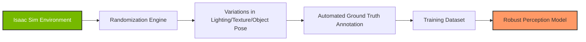
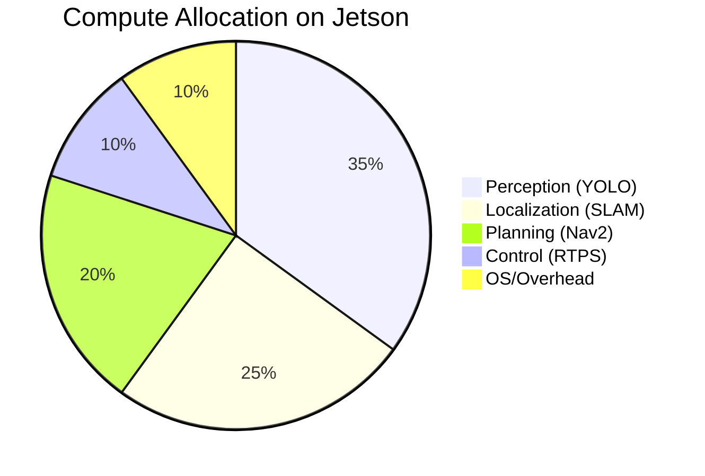

# Chapter 4 — Advanced AI with NVIDIA Isaac Platform

:::tip 🎯 Learning Objectives
By the end of this chapter, you will be able to:
- Utilize **NVIDIA Isaac Sim** for photorealistic synthetic data generation.
- Deploy **Isaac ROS** packages for GPU-accelerated perception on Jetson devices.
- Design **Reinforcement Learning (RL)** reward functions for bipedal locomotion.
- Apply **Sim-to-Real** transfer strategies, including domain randomization and system identification.
:::

---

## 📑 Table of Contents

- [Introduction to the Isaac Platform](#introduction-to-the-isaac-platform)
- [Isaac Sim and Synthetic Data](#isaac-sim-and-synthetic-data)
- [Hardware-Accelerated Perception with Isaac ROS](#hardware-accelerated-perception-with-isaac-ros)
- [Reinforcement Learning for Bipedal Control](#reinforcement-learning-for-bipedal-control)
- [Sim-to-Real Transfer Strategies](#sim-to-real-transfer-strategies)
- [Key Takeaways](#key-takeaways)

---

## Introduction to the Isaac Platform

The **NVIDIA Isaac Platform** represents the industrial standard for modern robotics AI. It bridges the gap between physics-based simulation and edge computing, providing a holistic workflow from "brain" (AI) to "body" (Hardware).

> **"The most efficient way to train a robot is to teach it a million lessons in a virtual world before it ever wakes up in ours."**

This chapter explores how to leverage this stack to create robust, intelligent humanoid systems.

---

## Isaac Sim and Synthetic Data

**NVIDIA Isaac Sim** is a robotics simulator built on **NVIDIA Omniverse**. Unlike standard simulators that rely on simplistic graphics, Isaac Sim utilizes ray tracing to create photorealistic environments. This is critical for training Computer Vision models that must work in the real world.

### The Synthetic Data Pipeline

Real-world data collection for robotics is slow, expensive, and dangerous (e.g., training a robot to fall safely). Isaac Sim allows for **Synthetic Data Generation (SDG)** at scale.



### Why Synthetic Data Matters

By programmatically randomizing environment variables, we create datasets that are impossible to collect manually.

| Capability | Impact |
|------------|--------|
| **Domain Randomization** | Models become invariant to lighting changes, shadows, and textures. |
| **Infinite Diversity** | Generate millions of unique scenes (offices, warehouses, homes). |
| **Perfect Labels** | 2D/3D bounding boxes, segmentation masks, and depth are generated automatically. |
| **Safe Failure** | Simulate risky scenarios (collisions, falls) without damaging hardware. |

---

## Hardware-Accelerated Perception with Isaac ROS

While simulation is for training, **Isaac ROS** is for execution. It provides a collection of GPU-accelerated ROS 2 packages designed to run efficiently on NVIDIA Jetson modules (Orin, Xavier).

### Core Capabilities

Isaac ROS moves the heavy computational load from the CPU to the GPU, enabling real-time performance on resource-constrained edge devices.

| Feature | Standard ROS (CPU) | Isaac ROS (GPU) |
|---------|--------------------|-----------------|
| **SLAM** | ~10-15 FPS | ~30+ FPS with higher map density |
| **Object Detection** | YOLOv8 @ ~15 FPS | YOLOv8 @ ~60+ FPS |
| **Stereo Depth** | High latency | Real-time disparity calculation |
| **Visual Odometry** | Drift-prone | Robust, high-frequency tracking |

### Embedded AI Considerations

Deploying on Jetson requires managing trade-offs between speed and accuracy.



**Key Skills:**
- **Quantization:** Converting FP32 models to INT8 to fit in memory and run faster.
- **Pipeline Optimization:** Using NVIDIA DeepStream to manage video streams efficiently.
- **Thermal Management:** Monitoring Jetson thermals to prevent throttling during complex tasks.

---

## Reinforcement Learning for Bipedal Control

Traditional control theory (PID, LQR) relies on manually tuned mathematical models. **Reinforcement Learning (RL)** allows a robot to learn *how* to walk by itself, discovering complex gaits that are difficult to program analytically.

### The RL Loop

In Isaac Sim, we treat the robot as an "agent" interacting with an "environment."

```mermaid
graph LR
    S[State<br/>Joint Angles + Velocity] --> P[Policy Network]
    P --> A[Action<br/>Joint Torques]
    A --> E[Physics Engine<br/>(Isaac Sim)]
    E --> R[Reward<br/>Forward Speed - Energy Cost]
    E --> S
    R --> P
    
    style P fill:#f9f,stroke:#333,stroke-width:2px
    style E fill:#bbf,stroke:#333,stroke-width:2px
```

### Reward Engineering

The core of RL is the reward function. Students learn to shape behavior by balancing competing objectives.

#### Example Reward Function for Walking
```python
def calculate_reward(observation):
    # 1. Primary Goal: Move Forward
    reward = (observation torso_x_velocity * 1.0)
    
    # 2. Stability Penalty: Don't fall
    reward -= (abs(observation torso_orientation) * 0.5)
    
    # 3. Efficiency Penalty: Don't waste energy
    reward -= (np.sum(observation joint_torques**2) * 0.01)
    
    # 4. Gait Regularization: Encourage smooth motion
    reward -= (np.sum(observation joint_velocities**2) * 0.05)
    
    # Termination: If robot falls, episode ends
    if observation.torso_height < 0.5:
        return -100.0
        
    return reward
```

### Parallel Simulation

RL requires millions of steps to converge. Isaac Sim supports **Headless Mode** and massive parallelism, allowing you to run thousands of robot instances simultaneously on a single server.

---

## Sim-to-Real Transfer Strategies

A policy that walks perfectly in simulation often falls flat in reality. This discrepancy is called the **Reality Gap**.

### The Reality Gap

Sources of error include:
- **Unmodeled Physics:** Simulation often ignores cable stiffness, motor backlash, or tire deformation.
- **Sensor Noise:** Camera noise in simulation is often too perfect compared to real sensors.
- **Latency:** Real hardware has communication delays that simulation ignores.

### Transfer Strategies

#### 1. Domain Randomization (DR)

Instead of trying to make the simulation perfect, we make the robot *robust* to imperfection. During training, we drastically randomize physical parameters.

```python
# Pseudo-code for Domain Randomization
environment.randomize({
    'friction_coefficient': uniform(0.4, 0.9),
    'mass_scale': uniform(0.8, 1.2),
    'camera_noise': uniform(0.0, 0.05),
    'joint_damping': uniform(0.1, 0.5)
})
```

**Result:** The robot learns a policy that works under *any* condition within a range, making it adaptable to the real world.

#### 2. System Identification

Before training, we perform experiments on the real robot to measure its physical properties and tune the simulation to match.

| Parameter | Sim Value | Measured Real Value | Adjustment |
|-----------|-----------|---------------------|------------|
| Friction | 0.8 | 0.65 | Update URDF |
| Joint Damping | 0.0 | 0.1 | Update Physics Engine |
| Torque Limit | 20 Nm | 18 Nm | Update Controller |

#### 3. Iterative Deployment

The process is rarely "one-shot."
1.  Train in Sim (Randomized).
2.  Deploy to Real Robot.
3.  Identify failure modes (e.g., slips on shiny floors).
4.  Add that specific failure case to the sim training.
5.  Retrain.

---

## Key Takeaways

- **Isaac Sim is not just a viewer; it's a data factory.** It enables the creation of massive, labeled datasets for free.
- **GPU acceleration is mandatory for modern robotics.** Isaac ROS unlocks real-time performance on embedded hardware.
- **RL unlocks emergent behaviors.** Robots can learn locomotion strategies that human engineers might not think of.
- **Bridging the Reality Gap is an art.** Success comes from aggressive Domain Randomization rather than perfect simulation fidelity.
- **Hardware in the Loop (HITL)** accelerates development. Rapidly iterating between Sim and Real is the key to shipping products.

---

### What's Next?

Now that we have the physics engine (Isaac) and the "brain" (RL/Perception) optimized, we need to give the robot a voice and high-level understanding.

**Next Chapter:** [Embodied AI & Human-Robot Interaction](../chapter-5) 🗣️🤖
```