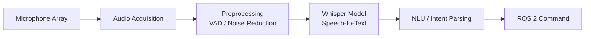
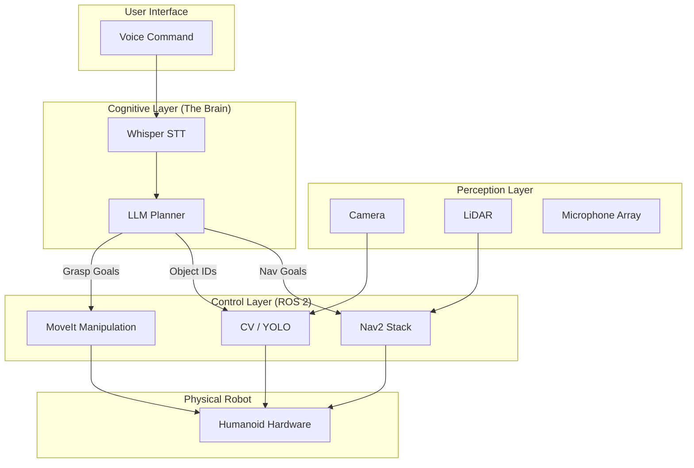

# Chapter 5: Embodied AI & The Future of Interaction

:::tip 🎯 Learning Objectives
By the end of this chapter, you will be able to:
- Implement robust **Voice-to-Action** pipelines using OpenAI Whisper and hardware arrays.
- Utilize **Large Language Models (LLMs)** for cognitive task planning and decomposition.
- Design a complete **Autonomous Humanoid System** integrating perception, navigation, and manipulation.
- Explore **Multi-Modal Interaction** (Gestures + Vision + Speech).
- Evaluate the ethical implications and safety protocols for deploying advanced humanoid robots.
:::

---

## 📑 Table of Contents

- [Introduction to Embodied AI](#introduction-to-embodied-ai)
- [Voice-to-Action with OpenAI Whisper](#voice-to-action-with-openai-whisper)
- [Cognitive Planning with Large Language Models](#cognitive-planning-with-large-language-models)
- [The Capstone: Autonomous Humanoid Project](#the-capstone-autonomous-humanoid-project)
- [Multi-Modal Interaction & Future Directions](#multi-modal-interaction--future-directions)
- [Key Takeaways](#key-takeaways)

---

## Introduction to Embodied AI

For decades, robots were **programmed machines**—following rigid scripts written by engineers. Today, we are entering the era of **Embodied AI**, where robots possess cognitive abilities that allow them to understand intent, reason about their environment, and interact naturally.

> **"The ultimate goal of robotics is not just automation, but partnership—machines that can understand us as well as they understand their own mechanics."**

This chapter bridges the gap between abstract intelligence (LLMs) and physical reality (Hardware). We transform the robot from a tool into an agent capable of collaboration.

---

## Voice-to-Action with OpenAI Whisper

Natural language is the most intuitive interface for human-robot interaction. If a user has to learn a programming language to move a robot arm, the robot has failed at usability.

### The Speech Pipeline

Converting sound into action requires a robust, real-time pipeline:



### Integrating OpenAI Whisper

OpenAI's Whisper model provides state-of-the-art speech recognition. In robotics, we utilize the **base** or **small** models to ensure low latency (real-time response) without sacrificing significant accuracy.

#### Hardware: Far-Field Arrays

In the real world, users don't speak directly into a microphone. We use **Far-Field Microphone Arrays** (e.g., ReSpeaker or USB-MIC Array) to capture voice from a distance.

**Key Challenges & Solutions:**

| Challenge | Solution | Technique |
|-----------|----------|-----------|
| **Background Noise** | Acoustic Echo Cancellation (AEC) | DSP chips on the array |
| **Reverberation** | Beamforming | Directional audio focusing |
| **Ambiguity** | Contextual NLP | LLM post-processing (covered next) |

#### Implementation: Whisper ROS 2 Node

Below is a practical implementation of a speech-to-text node using Whisper and `faster-whisper` for optimized inference.

```python
# whisper_node.py
import rclpy
from rclpy.node import Node
from audio_common_msgs.msg import AudioData
from std_msgs.msg import String
from faster_whisper import WhisperModel

class WhisperNode(Node):
    def __init__(self):
        super().__init__('whisper_node')
        
        # Load optimized model (quantized for speed)
        self.model = WhisperModel("small", device="cpu", compute_type="int8")
        
        self.subscription = self.create_subscription(
            AudioData,
            'audio',
            self.audio_callback,
            10
        )
        
        self.text_pub = self.create_publisher(String, 'transcript', 10)
        self.get_logger().info('Whisper ASR Node Started')
    
    def audio_callback(self, msg):
        # Convert ROS AudioData to float32 numpy array
        # Note: Implementation depends on audio encoding (16-bit PCM vs Float)
        audio_array = np.frombuffer(msg.data, dtype=np.int16).astype(np.float32) / 32768.0
        
        # Transcribe
        segments, info = self.model.transcribe(audio_array, beam_size=5)
        
        full_text = " ".join([segment.text for segment in segments])
        
        if len(full_text.strip()) > 0:
            msg = String()
            msg.data = full_text
            self.text_pub.publish(msg)
            self.get_logger().info(f"Heard: {full_text}")

def main(args=None):
    rclpy.init(args=args)
    node = WhisperNode()
    rclpy.spin(node)
    rclpy.shutdown()
```

---

## Cognitive Planning with Large Language Models

Speech recognition gives us *words*, but **Cognitive Planning** gives us *intent*. An LLM acts as the "brain," decomposing high-level vague commands into precise robotic primitives.

### The "Translator" Paradigm

The robot does not speak English; it speaks ROS 2 (Topics, Services, Actions). The LLM acts as a universal translator.

```mermaid
graph LR
    A[User Command<br>"Clean the room"] --> B[LLM Reasoning<br>Chain of Thought]
    B --> C[Function Calling<br>Structured Output]
    C --> D[ROS 2 Action Client]
    D --> E[Robot Execution]
    
    style A fill:#f9f,stroke:#333,stroke-width:2px
    style E fill:#bbf,stroke:#333,stroke-width:2px
```

### From Vague to Specific

Consider the command: *"Bring me the red cup from the kitchen."*

1.  **Perception:** LLM queries Vision Model → "Locate red cup."
2.  **Planning:** LLM generates a plan:
    *   Nav2 Goal: Navigate to Kitchen.
    *   Vision: Scan for Red Cup.
    *   MoveIt: Plan grasp trajectory.
    *   Nav2 Goal: Navigate to User.
3.  **Execution:** The plan is converted into a JSON structure that a Python ROS node executes.

#### Prompt Engineering for Robotics

To make this work, we use **Few-Shot Prompting** and **Function Calling**.

```python
# Example System Prompt for the Robot Brain
SYSTEM_PROMPT = """
You are a cognitive controller for a humanoid robot.
You have access to the following ROS 2 Functions:

1. navigate(location_name): Moves the robot to a predefined map location.
2. pick_up(object_name): Uses vision to find and grasp the object.
3. place(location_name): Places the held object at a location.

Output a JSON plan for the user's request.
User: "Clean the room."
Assistant: {
  "plan": [
    {"action": "navigate", "args": "living_room"},
    {"action": "pick_up", "args": "sock"},
    {"action": "navigate", "args": "laundry_basket"},
    {"action": "place", "args": "laundry_basket"}
  ]
}
"""
```

:::info 💡 Key Benefit
This architecture allows the robot to perform tasks it was never explicitly hard-coded to do, simply by understanding the relationship between language and its available capabilities.
:::

---

## The Capstone: Autonomous Humanoid Project

This is where all previous chapters converge. You will build a fully autonomous agent capable of completing complex, multi-step tasks based solely on voice commands.

### System Architecture



### The Task: "Serve the Guest"

**Scenario:** The robot is told, *"Go to the kitchen, find a soda, and bring it to the guest in the living room."*

**Execution Flow:**

1.  **Input:** Whisper transcribes audio to text.
2.  **Reasoning:** LLM parses the intent: `Task(Transport, "soda", Kitchen -> LivingRoom)`.
3.  **Navigation:** Nav2 receives a goal pose for the kitchen table.
4.  **Search:** The robot scans the table using YOLOv8 for "soda" or "bottle".
5.  **Manipulation:** MoveIt calculates Inverse Kinematics to grasp the bottle.
6.  **Delivery:** Nav2 plans a path to the guest (tracked via person detection).
7.  **Handover:** The robot extends arm and releases the object.

### Engineering Challenges

Students will face real-world issues that require creative problem solving:

- **Loop Closure:** "I can't find the soda." (LLM must re-plan: "Ask the user where it is.")
- **Localization Drift:** "I'm lost." (AMCL recovery behaviors.)
- **Dynamic Obstacles:** A person walks in front of the robot. (DWB local planner adjustment.)

---

## Multi-Modal Interaction & Future Directions

The future of HRI is not just voice; it is **Multi-Modal**—combining speech, vision, and gestures to emulate human social intelligence.

### Beyond Voice: Visual & Spatial Cues

Humans don't just say "hand me that"; they often *point* at "that". Integrating gesture recognition allows the robot to resolve spatial ambiguity.

**The Pointing Resolver Pipeline:**
1.  **Gesture Detection:** MediaPipe detects the user's index finger pointing.
2.  **Ray Casting:** Calculate the 3D ray from the user's finger tip into the scene.
3.  **Intersection:** Identify which objects in the point cloud intersect with the ray.
4.  **Disambiguation:** Pass the specific object ID (e.g., "the blue mug on the left shelf") to the LLM.

### Foundation Models for Robotics

We are moving toward **Generalist Robots**. Instead of training a separate model for every cup, door, and handle, we use large-scale foundation models (like RT-1 or RT-2) that have learned "how to interact" from millions of episodes.

| Current Approach | Future Approach |
|------------------|-----------------|
| **Specific:** Model trained to grasp a specific cup. | **General:** Policy trained to "grasp novel objects." |
| **Hard-coded:** If/else logic for states. | **Semantic:** Understanding "fragile" vs. "sturdy." |
| **Zero-Shot:** Cannot handle new objects. | **Zero-Shot:** Can handle unseen objects. |

### Ethics, Safety, and Society

As robots become more autonomous and capable, the engineering burden shifts from "making it work" to "making it safe."

#### The "Kill Switch" Protocol
Every autonomous system must have a hardware-level emergency stop that bypasses software.

#### Social Navigation
Robots must adhere to human social norms:
- **Proxemics:** Don't stand too close to humans.
- **Right-of-Way:** Yield to people in hallways.
- **Eye Contact:** Look at the person you are speaking to (using head pan/tilt).

> **"A robot that moves efficiently but scares people is a failed product."**

---

## Key Takeaways

1.  **Natural Language is the Interface:** Whisper and far-field audio allow anyone to control robots, not just programmers.
2.  **LLMs are the Cognitive Bridge:** They translate human intent into structured robot plans (ROS Actions).
3.  **The Capstone Tests Integration:** Success comes from making ROS 2 (Nav2, MoveIt), Perception, and AI work together seamlessly.
4.  **Multi-Modal is the Future:** Combining voice, vision, and gestures creates intuitive HRI.
5.  **Safety is Paramount:** Autonomous robots in human spaces require rigorous safety protocols and social awareness.

---

### What's Next?

You have completed the journey from basic ROS nodes to embodied AI. The world of humanoid robotics is evolving rapidly.

**Recommended Pathways:**
- 🎓 **Research:** Explore "Sim-to-Real" reinforcement learning.
- 🏭 **Industry:** Apply these skills to warehouse automation or manufacturing.
- 🚀 **Entrepreneurship:** Build custom service robots for specific accessibility needs.

:::tip 🚀 Final Thought
You are no longer just writing code; you are orchestrating minds and bodies. Go build the future.
:::
```